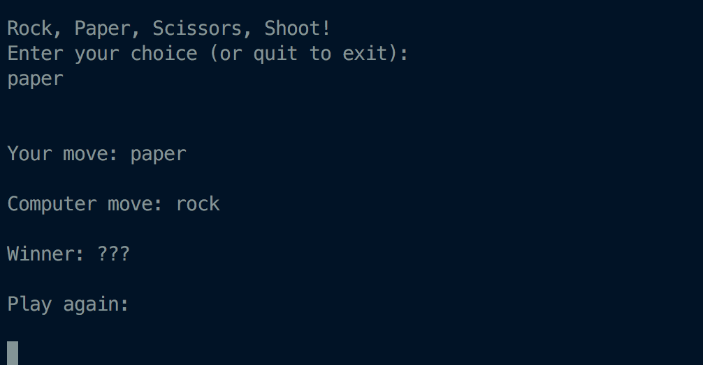

# Terminal Rock Paper Scissors Exercise

## Usage

- Install `node`
- Run `npm start`

## Goal

The goal is to write the logic to make the game work. Currently the computer always chooses `rock` and a winner is unknown.

 

## Stretch Goals

- Validate user input
  - Limit input to `rock`, `paper`, or `scissor`
  - Display an error and don't run game logic if the input is invalid
- Keep score
  - Keep tally of games won
  - Display current score between the user and the computer
- End the game (if keeping score)
  - Announce a winner after n number of rounds
  - Exit or restart the game
- Complicate the game
  - Implement rock, paper, scissors, lizard, spock
- Write tests for the game logic
- Style!
  - Add a personal touch, nobody likes boring black and white text
- Clean code
  - Well-indented with consistent semi-colon use
  - Write small functions (limit to 10 lines)
  - No magic numbers or strings (use variables) 
